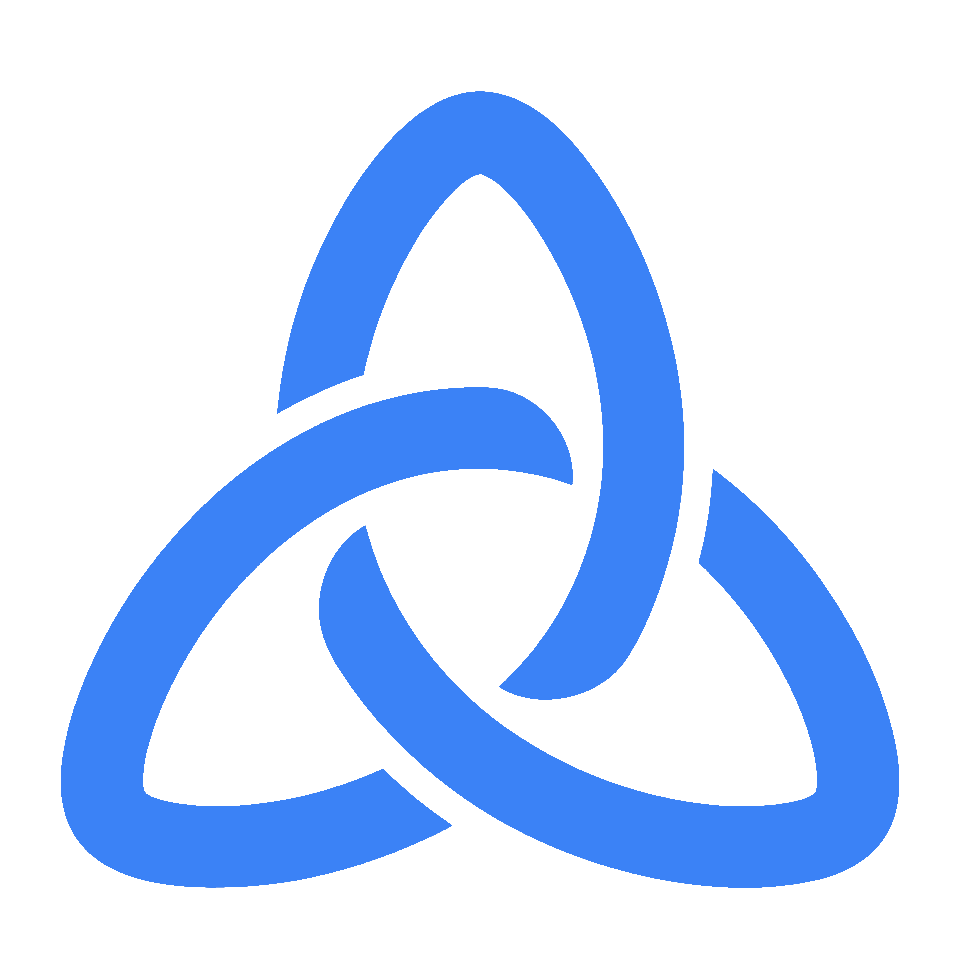

<!--
*** Thanks for checking out the projetc 'Pacto'. If you have a suggestion
*** that would make this better, please fork the repo and create a pull request
*** or simply open an issue with the tag "enhancement".
*** Don't forget to give the project a star!
*** Thanks again! Now go have fun exploring this resume! :D
-->

<!-- PROJECT SHIELDS -->
<!--
*** I'm using markdown "reference style" links for readability.
*** Reference links are enclosed in brackets [ ] instead of parentheses ( ).
*** See the bottom of this document for the declaration of the reference variables
*** for contributors-url, forks-url, etc.
-->

[![Contributors][contributors-shield]][contributors-url]
[![Forks][forks-shield]][forks-url]
[![Stargazers][stars-shield]][stars-url]
[![Issues][issues-shield]][issues-url]
[![MIT License][license-shield]][license-url]
[![LinkedIn][linkedin-shield]][linkedin-url]

<!-- PROJECT LOGO -->
 

  

<h3 align="center">Pacto</h3>

  

    Gérez vos commandes clients de façon simple et rapide avec PACTO
     
    <a href="https://github.com/NicolasSaumont/pacto"><strong>Explorer la documentation »</strong></a>
     
     
    <a href="https://github.com/NicolasSaumont/pacto">Voir une démo</a>
    ·
    <a href="https://github.com/NicolasSaumont/pacto/issues">Signaler un bug</a>
    ·
    <a href="https://github.com/NicolasSaumont/pacto/pulls">Demande de fonctionnalité</a>
  

<!-- TABLE OF CONTENTS -->

  
Sommaire

  <ol>
    <li>
      <a href="#about-the-project">A propos</a>
      <ul>
        <li><a href="#built-with">Développé avec</a></li>
      </ul>
    </li>
    <li>
      <a href="#getting-started">Commencer</a>
      <ul>
        <li><a href="#prerequisites">Pré-requis</a></li>
        <li><a href="#installation">Installation</a></li>
      </ul>
    </li>
    <li><a href="#usage">Usage</a></li>
    <li><a href="#roadmap">Feuille de route</a></li>
    <li><a href="#contributing">Contribuer</a></li>
    <li><a href="#license">License</a></li>
    <li><a href="#contact">Contact</a></li>
    <li><a href="#acknowledgments">Remerciements</a></li>
  </ol>

<!-- ABOUT THE PROJECT -->

## A propos

PACTO est une application de gestion de commandes conçue pour simplifier le suivi et l’organisation des ventes au quotidien. Elle permet de centraliser les informations essentielles en facilitant l’ajout et la gestion des clients, des produits et des commandes.

Grâce à une interface claire et efficace, PACTO offre la possibilité d’associer facilement des produits à chaque client, de créer et modifier des commandes en quelques clics, et de garder une vision globale de l’activité. Pensée pour gagner du temps et limiter les erreurs, l’application accompagne les utilisateurs dans la gestion fluide et structurée de leur activité commerciale.

[![Product Name Screen Shot][product-home-screenshot]](https://www.pacto.nicolassaumont.com)

[![Product Name Screen Shot][product-order-screenshot]](https://www.pacto.nicolassaumont.com)

[![Product Name Screen Shot][product-customer-screenshot]](https://www.pacto.nicolassaumont.com)

(<a href="#readme-top">Haut de la page</a>)

### Développé avec

- [![Vuejs][Vue.js]][Vuejs-url]
- [![Nuxt][Nuxt]][Nuxt-url]
- [![Nodejs][Node.js]][Node-url]
- [![Express][Express.js]][Express-url]

(<a href="#readme-top">Haut de la page</a>)

<!-- GETTING STARTED -->

## Commencer

Le projet n'a pas vocation à être mis en ligne, uniquement déployé en local pour le moment.

### Installation

- Clonez ou téléchargez le projet depuis son dépôt Github.
- Placez-vous au répertoire du projet.
- Lancez `./install.sh` pour installer les modules node nécessaires.

### Execution

- Placez-vous à la racine du projet.
- Lancez l'application en utilisant la commande : `./dev.sh`
- Ouvrez un navigateur et aller sur `http://localhost:3000` pour accéder à l'application.

(<a href="#readme-top">Haut de la page</a>)

<!-- ROADMAP -->

## Feuille de route

### V1

- [x] Gestion des clients
  - [x] Ajouter un client
  - [x] Modifier un client
  - [x] Supprimer un client
  - [x] Liste des clients
  - [x] Recherche simple (nom)
  - [x] Associer/Dissocier un produit
- [x] Gestion des produits
  - [x] Ajouter un produit
  - [x] Modifier un produit
  - [x] Supprimer un produit
  - [x] Liste des produits
- [x] Gestion des commandes
  - [x]  Créer une commande
  - [x]  Associer un client
  - [x]  Ajouter / supprimer des produits
  - [x]  Quantité par produit
  - [x]  Modifier une commande
  - [x]  Supprimer une commande
  - [x]  Liste des commandes
  - [x]  Impression du bon de commande
- [x]  Dashboard & suivi
  - [x]  Tableau de bord (nb commandes, nb clients, nb produits)
- [x]  Interface
  - [x]  Navigation claire (clients / produits / commandes)
  - [x]  Formulaires simples
  - [x]  Feedback utilisateur (succès / erreurs)
- [x]  Backend / DB
  - [x]  Modèle de données propre (users, clients, produits, commandes)
  - [x]  Relations client ↔ commande ↔ produits
  - [x]  API CRUD complète
  - [x]  Base de données locale
- [x]  App accessible localement

### V2

- [ ] Authentification
  - [ ] Inscription / connexion utilisateur
  - [ ] Gestion de session (JWT / cookies)
  - [ ] Déconnexion
- [ ] Gestion du stock
- [ ] Calcul du total automatique par commande 
- [ ] Responsive 
- [ ] Déploiement
  - [ ] App accessible en ligne
  - [ ] Base de données persistante
  - [ ] Variables d’environnement sécurisées
- [ ] Dashboard & suivi
  - [ ] Graphiques simples (ventes / période)
  - [ ] KPI principaux
- [ ] Amélioration des commandes
  - [ ] Statuts (brouillon, validée, livrée, annulée)
  - [ ] Historique des modifications
  - [ ] Numéro de commande automatique
  - [ ] Ajout de notes
- [ ] Gestion avancée des produits
  - [ ] Gestion du stock réel
  - [ ] Alertes stock faible
  - [ ] Catégories de produits
  - [ ] Images produits
- [ ] Clients améliorés
  - [ ] Historique des commandes par client
  - [ ] Fiche client détaillée
  - [ ] Tags / catégories de clients
- [ ] Notifications
  - [ ] Confirmation de commande
  - [ ] Alertes stock
  - [ ] Notifications internes
- [ ] Sécurité & rôles
  - [ ] Rôles utilisateurs (admin / user)
  - [ ] Permissions
  - [ ] Protection des routes

Voir les [problèmes non résolus](https://github.com/NicolasSaumont/pacto/issues) pour accéder à la liste complète des fonctionnalités proposées (et les bugs connus).

(<a href="#readme-top">Haut de la page</a>)

<!-- CONTRIBUTING -->

## Contributing

Les contributions sont ce qui fait de la communauté open source un endroit extraordinaire pour apprendre, inspirer et créer. Toutes vos contributions sont **très appréciées**.

Si vous avez une suggestion qui permettrait d'améliorer ce projet, merci de dupliquer le repo et de créer une requête. Vous pouvez aussi simplement ouvrir un problème avec le tag "enhancement".
N'oubliez pas de donner une étoile au projet ! Merci à tous !

(<a href="#readme-top">Haut de la page</a>)

<!-- LICENSE -->

## License

Distribué sous la licence MIT. Voir `LICENSE.txt` pour plus d'informations.

(<a href="#readme-top">Haut de la page</a>)

<!-- CONTACT -->

## Contact

Nicolas Saumont - [@NicolasSaumont](https://twitter.com/NicolasSaumont) - saumont.nicolas@gmail.com

Project Link: [https://github.com/NicolasSaumont/pacto](https://github.com/NicolasSaumont/pacto)

(<a href="#readme-top">Haut de la page</a>)

<!-- ACKNOWLEDGMENTS -->

## Acknowledgments

- [Img Shield](https://shields.io/)
- [Best README Template](https://github.com/othneildrew/Best-README-Template/blob/master/README.md)

(<a href="#readme-top">Haut de la page</a>)

<!-- MARKDOWN LINKS & IMAGES -->
<!-- https://www.markdownguide.org/basic-syntax/#reference-style-links -->

[contributors-shield]: https://img.shields.io/github/contributors/NicolasSaumont/pacto.svg?style=for-the-badge
[contributors-url]: https://github.com/NicolasSaumont/pacto/graphs/contributors
[forks-shield]: https://img.shields.io/github/forks/NicolasSaumont/pacto.svg?style=for-the-badge
[forks-url]: https://github.com/NicolasSaumont/pacto/network/members
[stars-shield]: https://img.shields.io/github/stars/NicolasSaumont/pacto.svg?style=for-the-badge
[stars-url]: https://github.com/NicolasSaumont/pacto/stargazers
[issues-shield]: https://img.shields.io/github/issues/NicolasSaumont/pacto.svg?style=for-the-badge
[issues-url]: https://github.com/NicolasSaumont/pacto/issues
[license-shield]: https://img.shields.io/github/license/NicolasSaumont/pacto.svg?style=for-the-badge
[license-url]: https://github.com/NicolasSaumont/pacto/blob/main/LICENSE.txt
[linkedin-shield]: https://img.shields.io/badge/-LinkedIn-black.svg?style=for-the-badge&logo=linkedin&colorB=555
[linkedin-url]: https://linkedin.com/in/nicolas-saumont
[product-home-screenshot]: front/public/screenshots/screenshot-home.png
[product-order-screenshot]: front/public/screenshots/screenshot-duplicate-order.png
[product-customer-screenshot]: front/public/screenshots/screenshot-edit-customer.png
[Vue.js]: https://img.shields.io/badge/Vue.js-35495E?style=for-the-badge&logo=vuedotjs&logoColor=4FC08D
[Vuejs-url]: https://vuejs.org/
[Nuxt]: https://img.shields.io/badge/nuxt.js-00DC82?style=for-the-badge&logo=nuxt.js&logoColor=white
[Nuxt-url]: https://nuxt.com/
[Node.js]: https://img.shields.io/badge/node.js-f41a36?style=for-the-badge&logo=Node.js&logoColor=white
[Node-url]: https://nodejs.org/fr
[Express.js]: https://img.shields.io/badge/express.js-35495E?style=for-the-badge&logo=express&logoColor=4FC08D
[Express-url]: https://expressjs.com/
